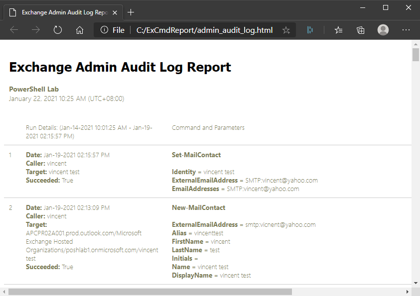
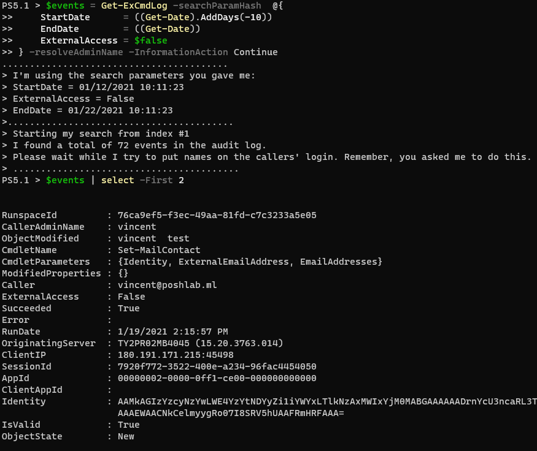
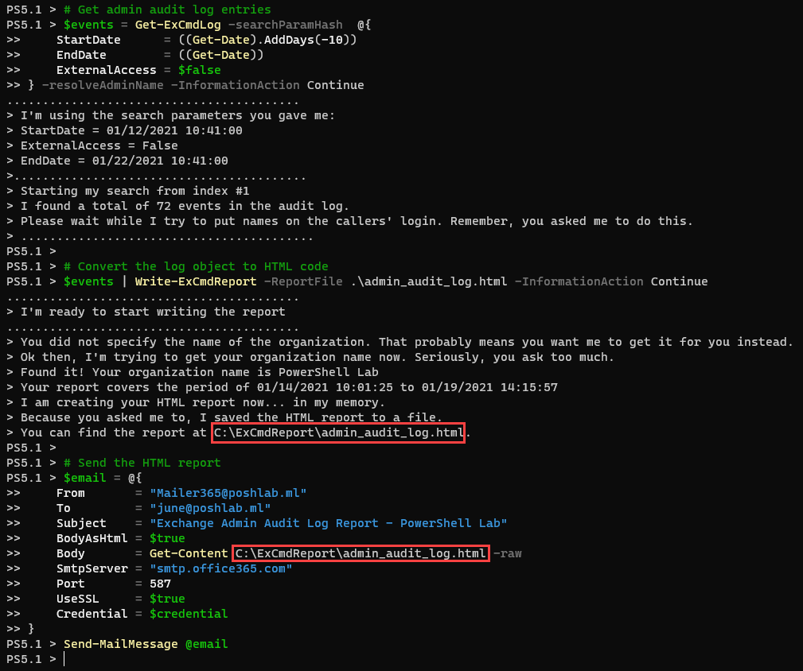

# ExCmdReport Module

- [Overview](#overview)
- [Release Notes](#release-notes)
- [Requirements](#requirements)
- [How to Install](#how-to-install)
  - [Option 1: Install to a PSModulePath](#option-1-install-to-a-psmodulepath)
  - [Option 2: Install to any folder](#option-2-install-to-any-folder)
- [Usage Examples](#usage-examples)
  - [Example 1: Get Admin Audit Log Entries from the last ten (10) days](#example-1-get-admin-audit-log-entries-from-the-last-ten-10-days)
  - [Example 2: Get Admin Audit Log Entries and Write the HTML Report](#example-2-get-admin-audit-log-entries-and-write-the-html-report)
  - [Example 3: Generate the Report and Send the Report by Email](#example-3-generate-the-report-and-send-the-report-by-email)
- [Functions](#functions)

## Overview

This module uses the `Search-AdminAuditLog` Exchange CmdLet under the hood. This can be used to retrieve Exchange Admin Audit Logs from Exchange Online or Exchange Server On-Premises. The output can then be exported as a pre-formatted HTML file with the option to send as email to specified recipients.



## Release Notes

Find the [release notes here](Doc/release_notes.md).

## Requirements

This module was tested with the following.

- Windows PowerShell 5.1. The ExchangeOnlineManagement module does not play well with PowerShell 7+. This may change in the future, but for now, stick with Windows PowerShell 5.1.
- Exchange Online (Office 365)
- Exchange Server 2016 (On-Premises).
- May work with Exchange 2013 and Exchange 2019.
- Remote PowerShell session must be established.
- Exchange Admin Audit Logging must be enabled. Otherwise, there will be no data to return.

## How to Install

### Option 1: Install to a PSModulePath

1. Download the latest [release](https://github.com/junecastillote/ExCmdReport/releases).
2. Extract the zip and run `.\InstallMe.ps1` in PowerShell.
   

3. Import the module:

   ```PowerShell
   Import-Module ExCmdReport
   ```

### Option 2: Install to any folder

1. Download the latest [release](https://github.com/junecastillote/ExCmdReport/releases).
2. Extract the zip.
3. Import the module file:

   ```PowerShell
   Import-Module .\ExCmdReport.psd1
   ```

## Usage Examples

### Example 1: Get Admin Audit Log Entries from the last ten (10) days

```PowerShell
# Get admin audit log entries
$events = Get-ExCmdLog -searchParamHash  @{
    StartDate      = ((Get-Date).AddDays(-10))
    EndDate        = ((Get-Date))
    ExternalAccess = $false
} -resolveAdminName -InformationAction Continue
```



### Example 2: Get Admin Audit Log Entries and Write the HTML Report

```PowerShell
# Get admin audit log entries
$events = Get-ExCmdLog -searchParamHash  @{
    StartDate      = ((Get-Date).AddDays(-10))
    EndDate        = ((Get-Date))
    ExternalAccess = $false
} -resolveAdminName -InformationAction Continue

# Convert the log object to HTML code
$events | Write-ExCmdReport -ReportFile .\admin_audit_log.html -InformationAction Continue
```



### Example 3: Generate the Report and Send the Report by Email

```PowerShell
# Get admin audit log entries
$events = Get-ExCmdLog -searchParamHash  @{
    StartDate      = ((Get-Date).AddDays(-10))
    EndDate        = ((Get-Date))
    ExternalAccess = $false
} -resolveAdminName -InformationAction Continue

# Convert the log object to HTML code
$events | Write-ExCmdReport -ReportFile .\admin_audit_log.html -InformationAction Continue

# Send the HTML report
$email = @{
    From       = "Mailer365@poshlab.ml"
    To         = "june@poshlab.ml"
    Subject    = "Exchange Admin Audit Log Report - PowerShell Lab"
    BodyAsHtml = $true
    Body       = Get-Content C:\ExCmdReport\admin_audit_log.html -raw
    SmtpServer = "smtp.office365.com"
    Port       = 587
    UseSSL     = $true
    Credential = $credential
}
Send-MailMessage @email
```


## Functions

There are two functions included in this version. For details, follow the links below.

- [Get-ExCmdLog](Doc/Get-ExCmdLog.md)
- [Write-ExCmdReport](Doc/Write-ExCmdReport.md)
